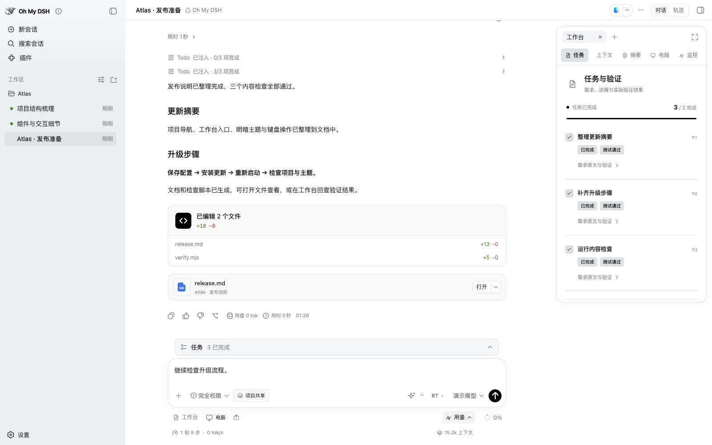
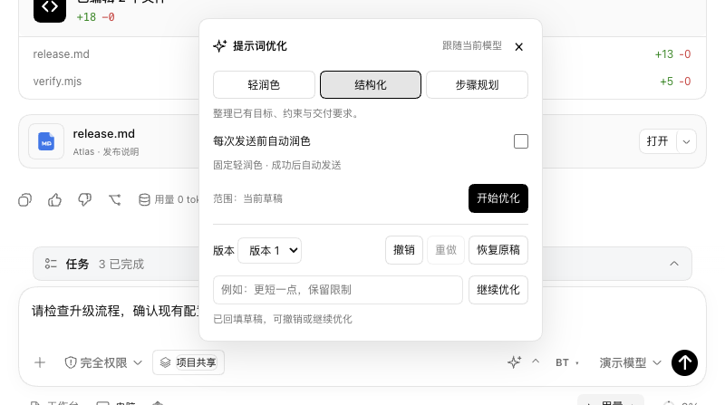
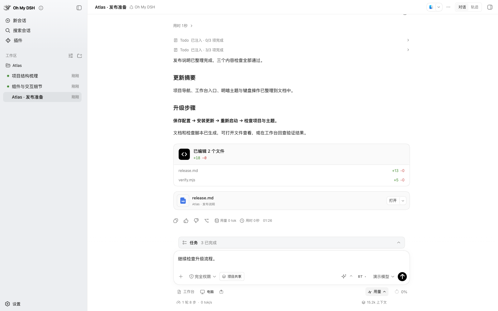
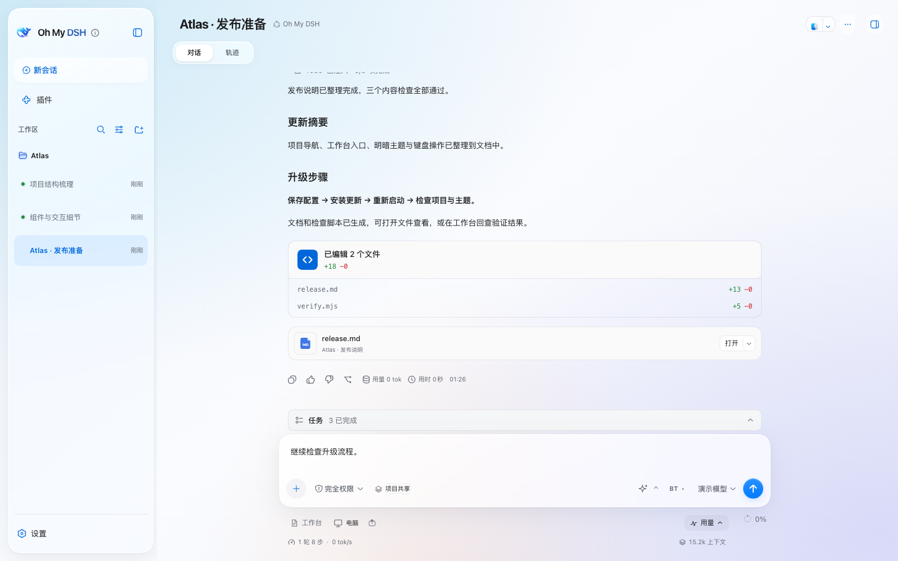
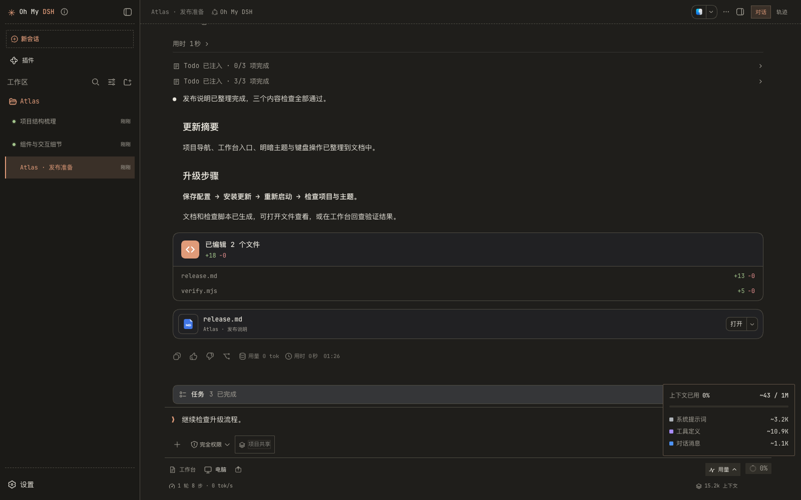
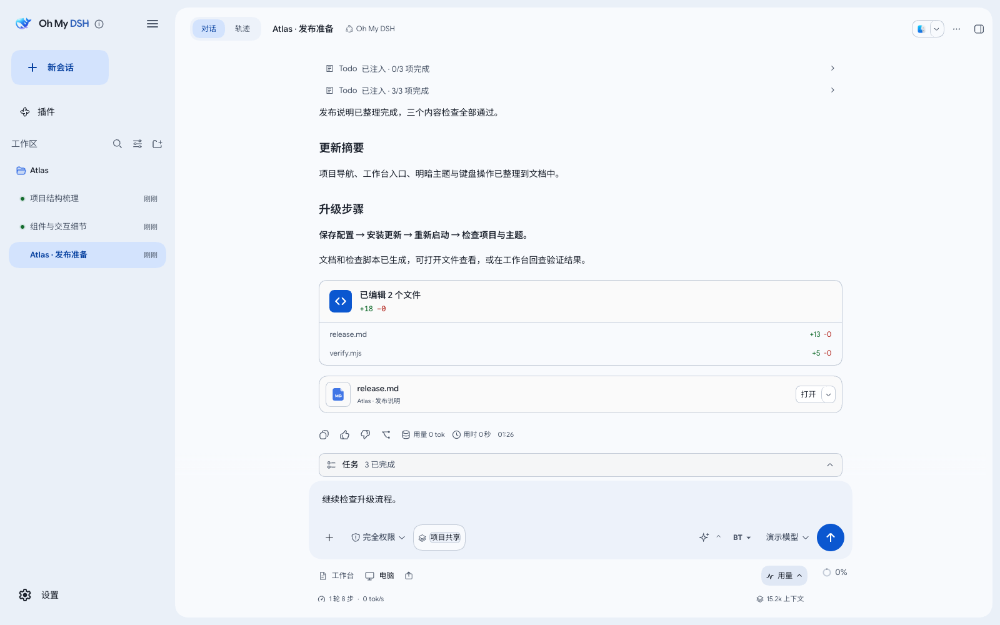
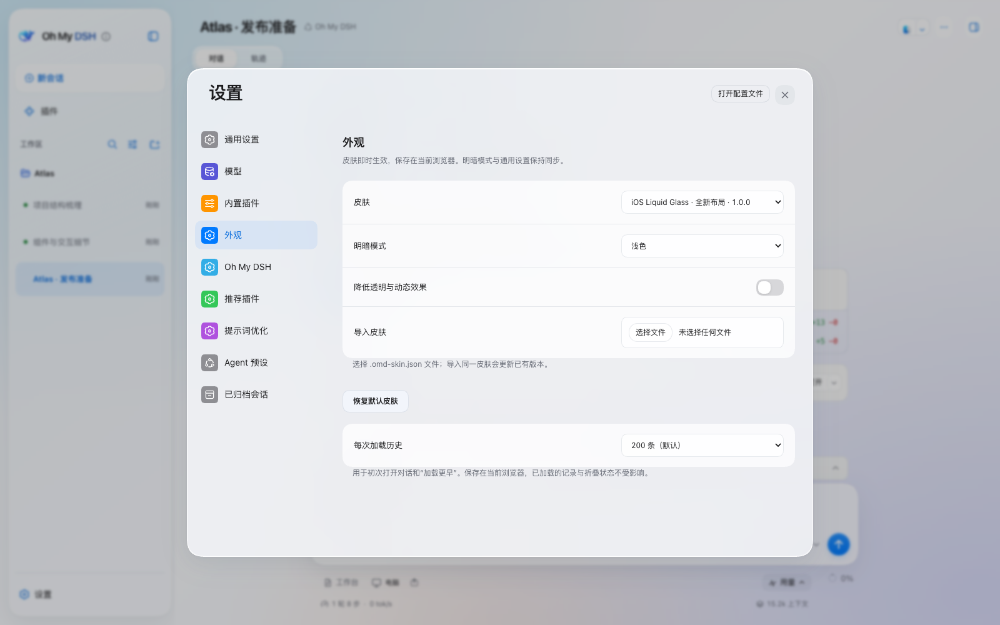

<p align="center">
  
</p>

<h1 align="center">Oh My DSH</h1>

<p align="center"><strong>让你的 DSH，火力全开。</strong></p>

<p align="center">
  长上下文 · 任务与验证 · 提示词优化 · 代码理解 · 电脑操作 · 四套完整主题<br />
  为 DeepSeek Harness 打造的一站式增强插件
</p>

<p align="center">
  <a href="https://github.com/gulagala001/oh-my-dsh/releases/tag/v1.7.0"></a>
  <a href="https://github.com/deepseek-ai/deepseek-harness"></a>
  <a href="#themes"></a>
</p>

<p align="center">
  <a href="#quickstart"><strong>立即安装</strong></a> ·
  <a href="#features">装上之后</a> ·
  <a href="#themes">挑选主题</a> ·
  <a href="docs/usage.md">使用指南</a> ·
  <a href="https://github.com/gulagala001/oh-my-dsh/releases/tag/v1.7.0">版本说明</a>
</p>



**把长对话、任务进度、代码、电脑和交付结果，放到同一套工作流程里。**

Oh My DSH 为 [DeepSeek Harness（DSH）](https://github.com/deepseek-ai/deepseek-harness) 配好上下文整理、任务提醒、结果验证、提示词优化和可视化工作台，再提供四套从布局到字体的完整主题。继续使用你已有的模型、会话、文件、工具和技能。

**当前为 1.7.0 正式版，适配 DSH 0.1.7-alpha.1。** 保留 OMD 的上下文、任务验证、后台任务和四套皮肤，融合原生工作过程、设置及会话格式。工具结束后立即显示完成汇总；展开阅读状态保留。旧宿主 DSH 0.1.6-alpha.2 请继续使用 [1.6.1](https://github.com/gulagala001/oh-my-dsh/releases/tag/v1.6.1)。

<a id="quickstart"></a>

## 装上，开始工作

从旧版 DSH 升级？先看[升级与安装教程](docs/upgrade.md)，按原数据目录和 profile 操作。

已有 **DSH 0.1.7-alpha.1 Web**？停止服务，在终端或 PowerShell 中运行：

```sh
dsh plugin --profile web add github:gulagala001/oh-my-dsh#v1.7.0
```

然后按原方式启动，例如 `dsh web`。打开启动时打印的登录链接，新建会话并选择 **Oh My DSH**。

**从这三个入口开始：** 输入框的星星优化草稿；**工作台**查看任务、上下文和结果；**设置 → 外观**选择主题。

自定义 profile 请替换命令中的 `web`，沿用原来的 `DSH_HOME`、模型和凭据。以上固定安装 **1.7.0 正式版**；[更新、卸载与源码试用](docs/usage.md#安装到现有-dsh推荐)。

<details>
<summary>运行要求与默认配置</summary>

- Node.js ≥22.19、pnpm 11.23.0、Git；Windows 使用 PowerShell 7。
- 模型需要支持原生工具调用；理解截图还需要图像输入能力。
- 插件将 Oh My DSH 设为默认 Agent preset，并配置完整文件／命令访问、关闭执行审批。profile 中的显式覆盖配置优先。
- 为兼容已有安装，内部插件与预设 ID 保留为 `trisoul_x` / `trisoul-x`。
- 仍使用 DSH 0.1.5-rc.1 时，请保留 [v1.1.1](https://github.com/gulagala001/oh-my-dsh/releases/tag/v1.1.1)。

[Windows 安装说明](docs/windows.md) · [模型与后台配置](docs/usage.md#日常使用)

</details>

<a id="features"></a>

## 装上之后，会有什么变化？

### 长对话，继续推进

后台把已经发生的工作整理成摘要与详细资料，在后续请求中按需替换。用户原话、文件和图片保留回查入口；项目摘要可以共享，会话也可以独立隔离。长任务需要的线索，有地方存、有路径找。

你可以在工作台检查处理记录、阅读详细资料，或手动决定压缩范围。[上下文如何工作](docs/context-workflow.md)。

### 做了什么，验过什么，一眼看清

任务对应原始需求，验证关联测试、命令或文字证据。进度、运行结果和交付文件集中呈现，工具细节逐层展开。

**BT（Better Todo）** 提供待办完成与验证完成提醒，按会话控制。待办提醒默认开启，验证提醒默认关闭。文件可以直接打开、预览和继续处理。

### 把想法整理清楚，再发送

输入框星星提供 **轻润色、结构化、步骤规划** 三档优化，直接改写当前草稿。支持撤销、重做、恢复原稿，也可以补充要求继续改。



自动轻润色默认关闭。开启后，每次发送先按最低档润色，再交给宿主发送；附件和引用继续保留。失败、取消或草稿冲突时保留输入。优化复用当前模型，每次会产生一次额外调用。[使用说明](docs/usage.md#提示词优化)。

### 看清代码结构，再动手

内置 **[CodeGraph](https://github.com/colbymchenry/codegraph)**，查询符号、源码、调用关系和变更影响。默认在项目会话中自动准备索引，无需另做全局安装。[CodeGraph 使用指南](docs/usage.md#codegraph)。

需要组合工具调用时，可以选择 **OMD-PTC** 预设，通过 `run_code` 串联工具，继续使用完整 OMD 能力。

<a id="computer-use"></a>

### 从代码，走到网页与桌面

内置 **[OpenCU](https://github.com/gulagala001/opencu)**。使用 `@Browser`、已连接的 `@Chrome` 或应用引用指定目标，让助手读取页面、点击、输入并检查结果。

- **看得到执行过程**：实时画面、助手光标和操作记录。
- **随时接手**：停止助手，手动操作，再恢复控制。
- **把问题指给它看**：窗口分享、区域圈选、元素批注与样式预览。
- **把结果留下来**：截图、网页快照与资源导出成为会话附件。

浏览器、桌面控制和运行环境统一在 **设置 → Oh My DSH → 基础组件** 管理。[电脑操作指南](docs/usage.md#computer-use预览版)。

<a id="themes"></a>

## 四套主题，四种工作氛围

**布局、字体、侧栏、输入区、设置与工作台一起设计。** 每套都支持浅色、深色和窄屏，在「设置 → 外观」即时切换。

<table>
  <tr>
    <td width="50%" valign="top">
      <a href="docs/images/readme-theme-codex.png"></a>
      <h3>Codex Desktop</h3>
      <p>黑白强调、冷灰侧栏、贯通顶栏与悬浮工作台。克制、清晰，给内容留出空间。</p>
      <a href="docs/codex-desktop.md">查看主题说明 →</a>
    </td>
    <td width="50%" valign="top">
      <a href="docs/images/readme-theme-ios.png"></a>
      <h3>iOS Liquid Glass</h3>
      <p>通透玻璃、柔和层次、圆角面板与分组设置。让工作台轻盈起来。</p>
      <a href="docs/ios-liquid-glass.md">查看主题说明 →</a>
    </td>
  </tr>
  <tr>
    <td width="50%" valign="top">
      <a href="docs/images/readme-theme-claude.png"></a>
      <h3>Claude CLI</h3>
      <p>暖黑与纸白、陶土橙、等宽文字和终端式布局。紧凑直接，保留熟悉的代码氛围。</p>
      <a href="docs/claude-cli-terminal.md">查看主题说明 →</a>
    </td>
    <td width="50%" valign="top">
      <a href="docs/images/readme-theme-material.png"></a>
      <h3>Google Material</h3>
      <p>Material 配色、Google 字体与图标、舒展的导航和设置。桌面与窄屏保持统一。</p>
      <a href="docs/google-material-expressive.md">查看主题说明 →</a>
    </td>
  </tr>
</table>

支持跟随系统明暗、降低透明与动态效果、导入主题和恢复默认。早期五套视觉皮肤已移除，本版只保留这四套完整主题。[主题使用与制作](docs/skins.md)。

<details>
<summary>设置也在主题覆盖范围内</summary>



</details>

<a id="support"></a>

## 平台与使用范围

| 能力 | 支持范围 |
| --- | --- |
| 上下文、任务、提示词优化、主题与工作台 | Windows、macOS、Linux |
| 内置浏览器与 Chrome 扩展连接 | Windows、macOS、Linux |
| 原生桌面与窗口分享 | macOS 14+、Windows 10 2004+；需要系统授权与对应运行环境 |

Mac 桌面控制需要辅助功能、屏幕录制权限与 Apple Command Line Tools；Windows 原生组件需要 .NET 10 SDK。首次使用先在运行环境页面完成准备。[完整平台说明](docs/usage.md#平台与运行条件)。

上下文整理与提示词优化会调用模型，摘要也可能损失细节；原始资料回查与外部验证仍然重要。皮肤适配 DSH 的真实功能，不提供对应品牌的账号服务。

## 这次更新

**1.7.0 正式版**：融合 DSH 0.1.7，完成原生分组、四套皮肤、后台执行与旧会话迁移适配，清理重复实现和失效测试。

[更新记录](CHANGELOG.md) · [本版验证与升级说明](docs/release-1.7.0.md) · [下载与校验文件](https://github.com/gulagala001/oh-my-dsh/releases/tag/v1.7.0)

## 文档与参与

- [使用指南](docs/usage.md)：安装、配置、日常操作、备份与开发。
- [上下文机制](docs/context-workflow.md)：摘要、原文回查、任务保留与手动压缩。
- [主题说明](docs/skins.md)：四套主题、导入格式与布局适配。
- [Windows 指南](docs/windows.md)：安装与原生环境准备。
- [反馈问题](https://github.com/gulagala001/oh-my-dsh/issues)：请提供版本、复现步骤和脱敏错误。

核心机制与提示词源自 trisoul，宿主与基础 Agent preset 基于 DeepSeek Harness。项目代码许可暂未指定；第三方来源与许可见 [THIRD_PARTY_NOTICES.md](THIRD_PARTY_NOTICES.md)。

<sub>截图摄于 2026-09-21，来自真实 DSH 界面的隔离演示会话。Atlas 为虚构示例项目，文件写入与内容检查实际执行；截图不包含私人会话或凭据。</sub>
