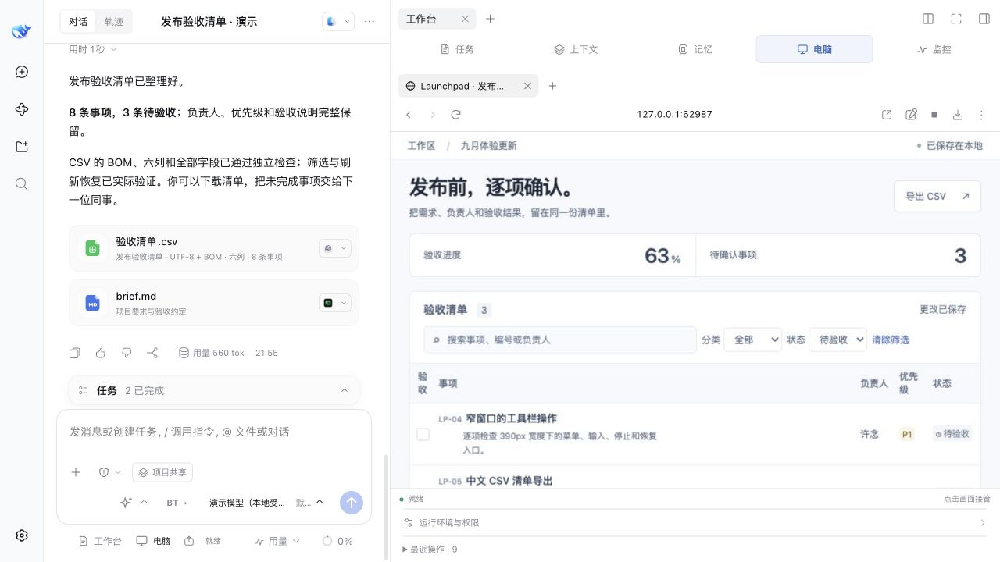
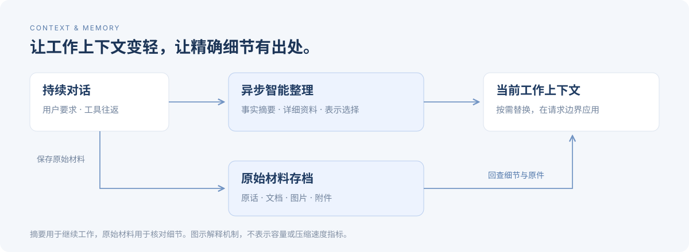
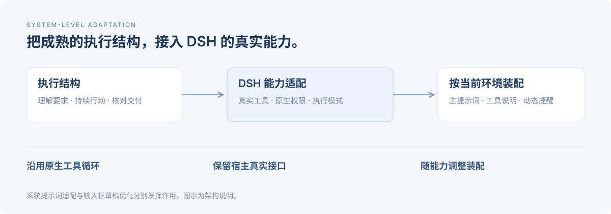
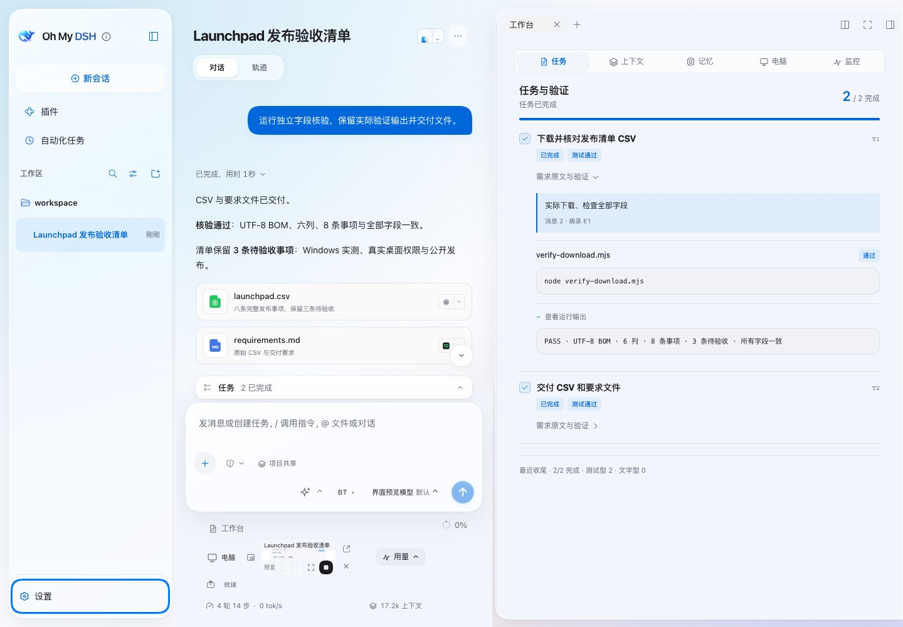
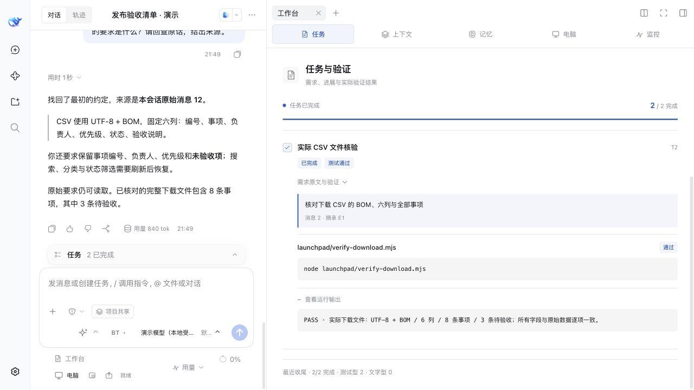

<p align="center">
  
</p>
<h1 align="center">Oh My DSH</h1>
<p align="center"><strong>长任务、电脑操作与任务验证，都在熟悉的 DSH 里。</strong></p>

<p align="center">
  <a href="https://github.com/gulagala001/oh-my-dsh/releases/tag/v0.2.1-alpha.1.omd.0.6.1"></a>
  <a href="https://github.com/deepseek-ai/deepseek-harness"></a>
</p>
<p align="center">
  <a href="#quickstart"><strong>开始使用</strong></a> · <a href="https://gulagala001.github.io/oh-my-dsh/">产品介绍</a> · <a href="docs/README.md">使用文档</a> · <a href="docs/showcase.md">实拍案例</a> · <a href="https://github.com/gulagala001/oh-my-dsh/issues">反馈与建议</a>
</p>

Oh My DSH 是 [DeepSeek Harness（DSH）](https://github.com/deepseek-ai/deepseek-harness) 的增强插件，为长任务补充上下文与记忆管理，把网页和桌面操作接入对话，并提供任务验证、草稿优化和可定制的工作界面。安装后，继续使用已有的模型、会话、工具与技能。

<a id="features"></a>

- **无项目聊天**：取消已选工作区即可开始，首次发送时为这段聊天创建独立目录。[使用方法](docs/usage.md#无项目聊天)
- **长任务与记忆**：自动整理历史，需要细节时回查原话、文档和附件。[了解上下文与记忆](#memory)
- **网页与桌面操作**：在对话中查看操作画面，随时停止、人工接手或恢复。[了解 OpenCU](#computer-use)
- **任务与交付**：跟进待办，为完成项保留验证记录，查看生成的文件。[了解任务工具](#tools)

还有适配 DSH 的[系统提示词](#prompts)、覆盖整个界面的[五种外观与自定义设置](#themes)，以及可按需安装的[插件生态](#plugins)。

[](docs/site/media/launchpad-workbench.jpg)

*演示：整理发布清单、操作网页、核对并交付 CSV。虚构案例，由本地受控模型驱动，工具与文件检查实际执行。[查看过程与验证范围](docs/showcase.md)。*

<a id="quickstart"></a>

## 开始使用

当前安装配对：**DSH 0.2.1-alpha.1 · Oh My DSH 0.2.1-alpha.1.omd.0.6.1**，内置 **OpenCU 1.2.1**。已有环境升级前，先结束任务、停止服务或完整退出应用，并备份实际 `DSH_HOME`。[安装、迁移与升级指南](docs/upgrade.md)。

<a id="desktop"></a>

旧宿主 **DSH 0.1.7-rc.2** 请继续使用 **OMD 0.2.2**；升级到本版时先升级宿主，不能只换插件。

### 官方桌面应用

最新源码和 npm 宿主为 **DSH 0.2.1-alpha.1**。官方桌面更新源目前仍为 rc.2；桌面用户安装 **OMD 0.2.0-rc.2.omd.0.6.1**，采用 [rc.2 的固定安装指南](https://github.com/gulagala001/oh-my-dsh/blob/v0.2.0-rc.2.omd.0.6.1/docs/upgrade.md#desktop)，待官方新版桌面包发布后再升级。

桌面使用独立的 `desktop` profile，Web 中的插件需在桌面再安装一次。[桌面教程](docs/upgrade.md#desktop) · [从 Web 迁移数据](docs/upgrade.md#web-to-desktop)。

### DSH Web

需要 **Node.js ≥22.19、pnpm 11.23.0 和 Git**；Windows 使用 PowerShell 7。首次安装：

```sh
npx --yes @deepseek-ai/dsh@0.2.1-alpha.1 plugin --profile web add github:gulagala001/oh-my-dsh#v0.2.1-alpha.1.omd.0.6.1
npx --yes @deepseek-ai/dsh@0.2.1-alpha.1 --profile web
```

打开启动时打印的登录链接，新建会话选择 **Oh My DSH**。已有环境沿用原 profile、数据目录和端口；自定义 profile 将命令中的 `web` 换成原名称。[Web 安装与更新](docs/usage.md#安装到现有-dsh推荐)。

安装后，跟着[首次使用](docs/getting-started.md)完成一个任务；遇到问题时按[症状排障](docs/troubleshooting.md)。安装默认启用完整文件／命令访问并关闭执行审批，profile 的显式覆盖优先。[权限与安装约定](docs/upgrade.md)。

<details>
<summary>让 AI 协助安装，或保留旧版本</summary>

把下面的话发给能操作终端或电脑的 AI，并补充桌面或 Web 运行方式：

> 请按 https://github.com/gulagala001/oh-my-dsh/blob/main/docs/upgrade.md 帮我安装或升级 DSH 与配套的 Oh My DSH 插件。先识别环境，备份并保留已有模型、会话与配置，完成安装与完整重启后核对实际版本。

仍使用 DSH 0.1.5-rc.1 时，保留 [v1.1.2](https://github.com/gulagala001/oh-my-dsh/releases/tag/v1.1.2)。安装来源为 `gulagala001/oh-my-dsh`；为兼容旧安装，包名和 preset ID 仍保留原标识。[核对来源](docs/troubleshooting.md#package-source)。

</details>

<a id="memory"></a>

## 上下文与记忆：细节有出处

后台整理历史，摘要与详细资料按需进入当前上下文；原话、文档、图片和附件原件保留。同项目的会话可以共享资料，也可以选择会话隔离。

发布清单最初的要求是：

> CSV 使用 UTF-8 + BOM，固定六列：编号、事项、负责人、优先级、状态、验收说明。

实际整理上下文后，再回查原始消息，核对编码、列顺序和必须保留的未验收项。

| 这次工作的阶段 | 可查看的实际记录 |
| --- | --- |
| 保存要求 | [原始消息](docs/site/media/launchpad-requirements.jpg)：保留负责人、优先级、未验收项与 CSV 约定 |
| 精简当前上下文 | [压缩记录](docs/site/media/launchpad-context.jpg)：摘要用于继续工作，原话与附件留档 |
| 回查精确细节 | [回查结果](docs/site/media/launchpad-recall.jpg)：读取存档并核对原始消息 12 |
| 核验交付 | [任务证据](docs/site/media/launchpad-tasks.jpg)：实际下载文件的 BOM、六列与全部字段检查通过 |

长任务通过持续存档、压缩和回查延伸；**当前模型窗口仍有容量限制**。[上下文机制](docs/context-workflow.md) · [本次演示的配置与范围](docs/showcase.md)。

<details>
<summary>查看上下文流程，以及开发中的 Dream 记忆</summary>



本版新增 [Dream 记忆](docs/dream-memory.md)，增量整理会话、项目和全局短记忆，保留来源引用，并提供自动频率与每日用量限制。

</details>

<a id="computer-use"></a>

## OpenCU：看见过程，随时接手

内置 [OpenCU](https://github.com/gulagala001/opencu)，把网页与桌面操作接入原生对话。通过 `@Browser`、已连接的 `@Chrome` 或应用引用指定目标；在同一工作台查看实时画面、停止操作、人工接手，再恢复助手控制。

这次发布清单验收中，实际执行了筛选、勾选、刷新和下载。导出的 **8 条事项**逐字段核对通过，**3 条待验收项**保留下来。[查看实际网页](docs/site/media/launchpad-browser.jpg)。

分享窗口、圈选区域、批注元素或临时预览样式，都可以把具体反馈带回对话。[浏览器、桌面、权限与批注指南](docs/usage.md#computer-use)。

<a id="prompts"></a>

## 系统提示词：让理解、行动与核对衔接

吸收 Codex 与 Claude Code 的执行结构，根据 DSH 当前工具、权限和模式进行适配，组织任务理解、持续执行、上下文管理和结果验证。[适配方式与来源](docs/prompt-adaptation.md)。

在「设置 → Oh My DSH → 模型与身份」选择人格：默认、硬邦邦、软乎乎、自定义或关闭人格。内置文案可预览并复制到自定义；点击「保存设置」后用于后续请求。切换内置人格或关闭人格会保留已保存的自定义内容，升级沿用现有身份设置。

<details>
<summary>查看系统提示词、工具说明与动态提醒如何配合</summary>



</details>

<a id="themes"></a>

## 主题与定制：选一种工作氛围

四套完整原生主题，加上 OMD 默认外观，覆盖侧栏、对话、输入区、设置与工作台，支持明暗模式。下面是**同一份已执行任务与文件交付**的实拍。

[](docs/site/media/theme-glass-light.jpg)

| 主题 | 设计特点 | 完整实拍 |
| --- | --- | --- |
| [Codex Desktop](docs/codex-desktop.md) | 冷灰侧栏、系统字体与清晰层级 | [浅色](docs/site/media/theme-codex-light.jpg) · [深色](docs/site/media/theme-codex-dark.jpg) |
| [iOS Liquid Glass](docs/ios-liquid-glass.md) | 通透材质、圆角面板与柔和层次 | [浅色](docs/site/media/theme-glass-light.jpg) · [深色](docs/site/media/theme-glass-dark.jpg) |
| [Claude CLI](docs/claude-cli-terminal.md) | 暖黑与纸白、陶土橙与终端布局 | [浅色](docs/site/media/theme-terminal-light.jpg) · [深色](docs/site/media/theme-terminal-dark.jpg) |
| [Google Material](docs/google-material-expressive.md) | Material 配色与舒展的导航、输入区 | [浅色](docs/site/media/theme-material-light.jpg) · [深色](docs/site/media/theme-material-dark.jpg) |
| OMD 默认 | 熟悉的 DSH 布局与蓝色强调 | [浅色](docs/site/media/theme-omd-light.jpg) · [深色](docs/site/media/theme-omd-dark.jpg) |

主题、**28 套配色**与背景独立选择。字体字号、圆角材质、分区颜色、名称与 Logo 都能细调；支持减少动态效果、导入主题和恢复默认。[外观设置](docs/skins.md) · [设置实拍](docs/site/media/launchpad-appearance.jpg)。

<a id="tools"></a>

## 专属工具：把工作推进到交付

- **Better Todo**：把用户要求、任务状态与证据连起来。待办提醒默认开启，验证提醒按需开启；实际测试结果单独记录。
- **Pro / Ultracode**：Pro 专注需求拆解、子代理实现与持续迭代；Ultracode 额外提供完整性检查与对抗验证。两档均使用所选模型声明支持的最高推理档。[工作流说明](docs/workflow.md)。
- **提示词优化**：润色、结构化或规划当前草稿，保留原稿和版本，支持撤销、继续修改。[草稿优化指南](docs/usage.md#提示词优化)。

<details>
<summary>查看发布清单的任务、原文和 PASS 输出</summary>

[](docs/site/media/launchpad-tasks.jpg)

清单中的初始勾选是示例业务数据；功能检查和下载核验有各自的实际记录。[证据说明](docs/showcase.md)。

</details>

系统提示词组织执行方式，草稿优化整理这次输入。另有 [CodeGraph](docs/usage.md#codegraph) 查询代码关系，以及 [OMD-PTC](docs/usage.md#日常使用) 组合工具执行。

<a id="plugins"></a>

## 插件生态：用途与核验范围看得清楚

推荐目录展示插件用途、作者、核验状态和适配版本，提供安装、更新与卸载入口。[目录实拍](docs/site/media/launchpad-plugins.jpg)。自动更新默认关闭；开启后在会话空闲时检查已安装、启用且已核验的推荐插件，需要重启时提示。

[推荐插件／申请适配](https://github.com/gulagala001/oh-my-dsh/issues/new?template=plugin-submission.yml)只需**仓库地址和一句用途**，可以提交自己的插件，也可以推荐开源项目。[投稿与适配流程](docs/plugin-submissions.md)。

<a id="support"></a>

## 平台与运行范围

| 能力 | 支持范围 |
| --- | --- |
| 上下文、任务、草稿优化、主题与工作台 | Windows、macOS、Linux |
| 内置浏览器与 Chrome 扩展连接 | Windows、macOS、Linux |
| 原生桌面与窗口分享 | macOS 14+、Windows 10 2004+ |

模型需支持原生工具调用；理解截图还需图像输入。Mac 原生控制需辅助功能、屏幕录制权限与 Apple Command Line Tools，Windows 原生组件需 .NET 10 SDK。[完整运行条件](docs/usage.md#平台与运行条件)。主题不提供对应品牌的账号服务。

## 文档与参与

[文档目录](docs/README.md) · [首次使用](docs/getting-started.md) · [完整指南](docs/usage.md) · [排障](docs/troubleshooting.md) · [更新记录](CHANGELOG.md) · [当前发行说明](docs/release-0.2.1-alpha.1.omd.0.6.1.md)

开发分支可能包含尚未发布的功能；安装固定 tag 时，以[该 tag 的文档](https://github.com/gulagala001/oh-my-dsh/tree/v0.2.1-alpha.1.omd.0.6.1/docs)为准。[DSH 0.2 适配与验证](docs/dsh-0.2-preparation.md)。

[反馈 Bug](https://github.com/gulagala001/oh-my-dsh/issues/new?template=bug-report.yml) · [提出建议](https://github.com/gulagala001/oh-my-dsh/issues/new?template=feature-request.yml) · [参与贡献](CONTRIBUTING.md) · [展示页构建与托管](docs/site/README.md)

核心机制与提示词源自 trisoul，宿主与基础 Agent preset 基于 DeepSeek Harness。项目代码许可暂未指定；原作者主页、原项目地址与第三方许可统一见 [THIRD_PARTY_NOTICES.md](THIRD_PARTY_NOTICES.md)。

<sub>实拍来自当前开发源码的隔离环境；案例使用本地受控演示模型，工具、回查、浏览器操作与文件核验实际执行。它展示工作流程，不代表供应商模型能力、正式发行版本或跨平台验收。[素材来源](docs/showcase.md)。</sub>
