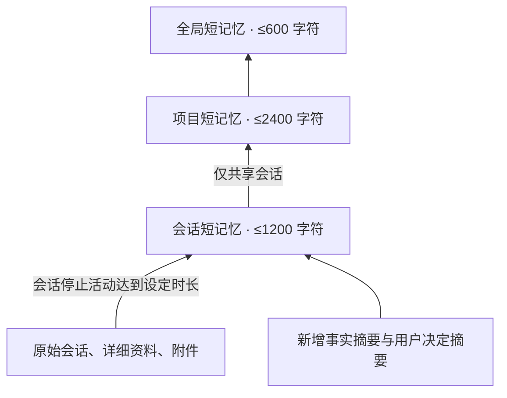

# Dream 记忆

[使用指南](usage.md) · [上下文整理](context-workflow.md)

Dream 从 OMD 0.1.7-rc.2.20 开始提供；安装配对见[发布说明](README.md#版本与文档范围)。

Dream 把已有材料逐级整理为短记忆。它在后台执行，聊天只读取已经完成的版本。



整理向上，回查向下。独立会话可单独 Dream，其内容不进入项目或全局。原始材料和历史版本保留；短记忆是有损整理，需要精确细节时回查来源。

## 四个入口

工作台的 **记忆** 页只提供四个 Dream 入口：

| 入口 | 实际处理范围 |
| --- | --- |
| 整理会话 | 所选会话；未选择时为当前会话。只更新会话短记忆 |
| 整理项目 | 所选项目的共享会话 → 该项目短记忆 |
| 整理全局 | 各项目共享会话 → 各项目短记忆 → 全局短记忆 |
| 自动整理设置 | 启用、检查间隔、原文等待时长、每日 token 上限、固定后台模型 |

点击项目可以展开会话；点击会话可以查看摘要和详细资料。目录支持搜索、分页；返回上级时保留该层的搜索、页码和浏览位置，目录更新后保留搜索并回到第一页。层级路径只显示正在浏览的项目与会话，另有“当前会话”快捷入口。会话改名会同步更新目录名称。“查看来源”逐层读取不可变版本，条目显示来源名称、版本或事件范围，以及保存内容的短预览。作业显示具体会话或项目，正在运行的作业优先显示，其余可展开“其他作业”查看并分别操作。界面显示执行进度、失败原因和当日用量，可以停止、继续；失败时点击作业旁的“重试”，沿原范围继续已保存的进度。停止保留已完成部分，不让迟到输出覆盖记忆。

项目按会话所属工作目录及既有项目绑定确定，不自动猜测主题；缺失目录的旧会话列入“未归类”。目录中的明确读取可以访问独立会话，不会因此把它加入共享整理。

未加入工作区的 Chat 会按需创建用于保存文件的独立目录；该目录不是 Dream 项目。这类会话及未另行加入真实工作区的后代保持会话隔离，不参加自动、项目或全局共享整理，仍可主动整理所选会话、回查原文。归属通过已有的持久化分配记录核对；改动默认保存根目录或删除文件目录不会把历史 Chat 变成共享项目。仅目录同名或使用某个 Chat 预设不会改变共享范围。用户明确把会话加入原生工作区后，按该会话的工作区归属与已选范围处理。

升级会使旧的错误共享项目及全局记忆停止注入；有健康共享来源时重建父记忆，不再把失效旧摘要送回模型，没有共享来源时不为生成空记忆调用模型。原始会话、会话短记忆和历史版本保留，显式回查仍可访问。归属记录读取异常会记录诊断并暂时隔离共享，基础聊天继续。

“查看来源”会打开独立阅读区；长正文使用整页滚动，返回入口固定在顶部。按 Escape 或点击返回可逐层回到上一份来源，保留阅读位置；回到记忆页时，原来的展开状态和滚动位置也保留。读取失败会在当前阅读区显示，稍后返回的结果不会打断对话输入。

## 哪些内容进入聊天

首次发消息前选择会话范围，开始后保持绑定：

| 模式 | 自动提供 | 按需回查 |
| --- | --- | --- |
| 会话隔离 | 不自动提供共享记忆 | 明确使用 `recall` 可读取任意会话 |
| 项目共享 | 本项目已生成的短记忆 | 项目 → 会话 → 摘要、资料、原文 |
| 全局记忆 | 精简全局记忆与项目目录首页 | 全局 → 项目 → 会话 → 来源 |

不把所有项目短记忆一次性塞进上下文，也不做主题分类或语义匹配。记忆块按版本替换，不每轮追加；上下文空间不足时只保留回查入口，连入口也放不下时不注入。该块最多占可用模型容量的 10%，并受 9,000 保守估算 token 的硬上限约束。全局项目目录每页最多 3 项。

当前会话的对话压缩仍由 ContextPipeline 负责。用户手填的“全局背景”仍是独立固定文本，只由用户维护；Dream 不修改它。旧 `full` 配置继续按项目共享解释，新全局模式使用 `global`。

## 输入、更新与费用

每次会话 Dream 只接收**已有会话短记忆＋尚未处理的摘要批次**。事实摘要保持原有规则；用户明确决定在同一次预处理调用中单独保存摘要、原话引用和事件编号，不混入“已完成工作”。没有摘要的新会话会等待，不为了填满记忆即时处理原文。

原文等待默认 **7 天无实际活动**。满足后，才分批补充摘要以下的原始事件；该进度与摘要进度独立记录。附件只保留原始引用，不根据文件名推断内容。活跃会话不深读原文；摘要也只覆盖已经结束的回合。分支已经继承的历史不重复整理。

项目 Dream 只接收已有项目短记忆和发生版本变化的会话短记忆；全局 Dream 同理，只接收变化的项目短记忆。读取目录或聊天不会触发 Dream。没有新材料、没有下层版本变化，就没有模型调用。旧原文晚到不代表证据更新，提示词要求按原始事件顺序处理修正关系。

默认自动关闭，开启后每 **60 分钟**检查一次；手动与自动共用 **200,000 token／日**额度。自动执行需要固定后台模型；也可沿用已经固定的预处理后台模型。手动可使用当前会话的模型路由。

设置只保存本次修改的字段。保存期间继续输入的内容保留在编辑框中，需要再次保存；其他窗口修改的未编辑字段不会被旧表单覆盖。检查间隔支持小数分钟，每日额度可填写任意非负整数。

单次输入上限为 **16,000 token 的保守估算**，每批最多 24 份来源；大原文按不超过 5,000 UTF-8 字节分段，不截断丢弃。这里用序列化请求字节数估算输入，通常高于实际 token 数，不能当成真实账单。调用前预留输入及最大输出额度，结束后以提供方的输入、缓存和输出用量结算；取消或缺少用量时保留预留额。额度每天 **UTC 00:00** 重置，界面显示本地时间。

例如，新的一段摘要仅需一次会话调用；项目内 Dream 再加一次项目调用，全局 Dream 再加一次全局调用。材料较多时分批，每批仍受同样上限约束；无变化的重复操作为零模型调用。实际输入量取决于摘要长度、语言和来源数量，不能预先承诺固定价格。

## 可靠性与数据

来源、版本、处理进度和发布结果在 SQLite 事务中一起提交。固定来源范围，发布前核验原文或摘要仍一致；进程间租约控制同一数据目录的执行权。异常退出后，接替进程等待原租约到期再恢复未完成队列，已处理来源不重放；旧进程恢复后不能改写接替者的作业状态或进度。模型失败不覆盖旧记忆。来源退出共享或消失时，相关项目及全局记忆停止自动注入，重新整理后恢复。

升级时会兼容已核对结构的旧插件来源标记，使可迁移的旧会话恢复读取和整理。迁移保留原始日志，核对宿主目录身份与重复会话标识，并沿用宿主对事件引用、继承范围及内容的校验；插件控制消息保留其来源身份，不作为用户原话整理。未知来源或未经核对的附加字段仍会明确拒绝迁移。

目录已识别的单份会话日志正文损坏或格式暂不支持，不会阻断其他会话的目录、自动整理和已保存作业的继续执行。记忆页会列出暂不可读取的会话，保留原始日志与最后可读的短记忆，并将异常来源移出共享汇总；完成提示说明跳过的范围。日志变化后会自动重新核对；修复日志或更新兼容支持后，也可点击“刷新”重试这些会话，即使日志版本未变也会重新读取，无需调用模型。取消操作和存储服务故障仍会明确报错，不会当成成功跳过。中断的迁移事务继续按严格恢复规则处理，避免覆盖未完成的发布。

没变化的会话跳过扫描。完成的任务清单立即清理，运行记录保留 30 天；不可变记忆版本与来源引用保留，存储随实际新增材料增长。保存全部历史与无限制磁盘容量不是同一件事：Dream 控制的是每次上下文、每次调用和每日用量，不承诺档案永远不增长。

数据位于插件数据目录的 `dream-v1/memory.sqlite`，不改写原始会话日志、既有 `context-v1` 档案或手写背景。备份时停止宿主后备份整个插件及 DSH 数据目录。停用插件停止后台任务；重新启用可继续。旧自动记忆执行器不恢复，旧数据仍可只读访问。

工具示例：

```js
recall({ memory: "global" })
recall({ memory: "projects" })
recall({ memory: "project", project: "目录返回的项目 ID" })
recall({ memory: "sessions", project: "目录返回的项目 ID" })
recall({ sessionId: "会话 ID" }) // 分页摘要目录
recall({ sessionId: "会话 ID", id: "摘要 ID" })
recall({ reference: "读取结果中的引用" })
recall({ reference: "记忆引用", query: "sources", cursor: "nextSources" })
recall({ sessionId: "会话 ID", from: 20, to: 25 })
```

文字长于单页时按返回的 `nextCursor` 继续同一读取；图片和文件可用 `asset` 重新打开原件。记忆和原文均为历史资料，不构成执行指令。
