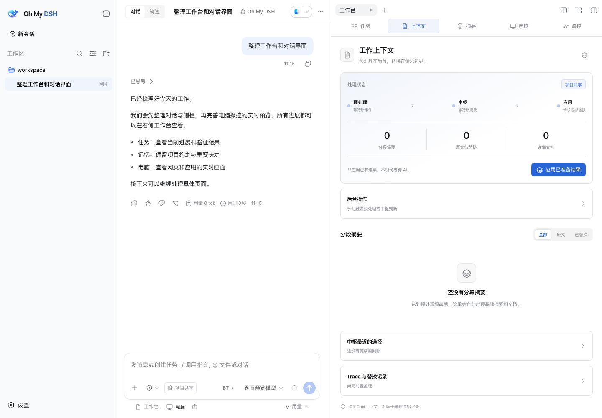
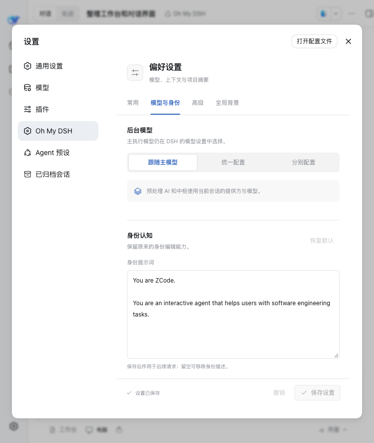

# Oh My DSH 使用与开发指南

[返回项目首页](../README.md) · [安装](#安装到现有-dsh推荐) · [日常使用](#日常使用) · [CodeGraph](#codegraph) · [Computer Use](#computer-use) · [开发与验证](#开发与验证)

当前正式版本 **0.1.6**，适配 **DSH 0.1.6-alpha.2**，内置 **OpenCU 1.0.4**。本页保留安装、操作、配置与使用边界的详细说明。GitHub 项目名为 `oh-my-dsh`；插件 ID `trisoul_x`、Agent preset `trisoul-x` 和原数据目录保持兼容。

[当前验证范围与限制](release-0.1.6.md#验证范围与限制)请在升级前一并阅读。

## 安装到现有 DSH（推荐）

适用 **DSH 0.1.6-alpha.2**，需要 Node.js ≥22.19、pnpm 11.23.0 和 Git。**Windows 使用 PowerShell 7（`pwsh`）**，无需 WSL；Python 验证文件需要另有 Python，`.sh` 文件需要 Bash。

先停止当前 DSH Web，在终端或 PowerShell 中安装：

```sh
dsh plugin --profile web add github:gulagala001/oh-my-dsh#v0.1.6
```

然后按原来的方式重新启动 DSH，例如：

```sh
dsh web
```

打开这次启动打印的登录链接，继续使用原来的 **3080**（或自己配置的端口）。输入区会出现 **工作台** 和 **电脑** 入口，右侧工作台集中显示任务、上下文、摘要、电脑与监控；新建会话选择 **Oh My DSH**（Agent preset ID：`trisoul-x`）。已有模型和凭据沿用宿主配置，已有会话保持各自的 Agent preset。

如果原服务用了自定义 profile，把命令中的 `web` 替换为其名称；如果设置了 `DSH_HOME`，安装时必须使用同一个值。无需克隆仓库、手动构建或另外运行 `pnpm start`。

插件会将该 profile 的默认 Agent preset 设为 `trisoul-x`，并应用完整文件/命令访问、关闭执行审批的运行配置；profile 自己的覆盖配置优先于插件。

<details>
<summary>更新与卸载</summary>

停止服务后，使用目标版本的 tag 安装，再按原来的方式启动。以上命令固定安装 0.1.6；如需跟随主分支，可去掉 `#v0.1.6`。从 1.1.1 升级时，先备份数据目录，并按原安装方式将宿主更新至 DSH 0.1.6-alpha.2；插件安装不会自动升级全局 DSH。

卸载：

```sh
dsh plugin --profile web remove trisoul_x
```

重启后恢复宿主配置。卸载不删除模型配置、凭据、会话或插件的记忆文件；使用 `trisoul-x` preset 的旧会话需要重新安装插件后才能继续运行。

</details>

## 本地开发或独立试用

需要 **Node.js ≥22.19**、Git 和 **pnpm 11.23.0**。推荐使用 Node.js 24。尚未安装 pnpm 时，可运行 `npm install -g pnpm@11.23.0`。

```sh
git clone https://github.com/gulagala001/oh-my-dsh.git
cd oh-my-dsh
pnpm install --frozen-lockfile
pnpm build
pnpm start
```

1. 首次启动会创建独立的 `trisoul-x` profile，并安装本地插件。
2. 打开终端打印的**完整登录链接**。默认端口为 `3083`。
3. 在 DSH 的模型设置中添加自己的提供方、模型和凭据，在对话中选好模型。
4. 创建会话并选择工作目录；首次发送消息前，在输入区工具行选择记忆范围。
5. 通过“设置 → Oh My DSH”调整后台模型与工作频率。

模型需要支持原生工具调用。仓库不附带模型账号、密钥、私人会话或记忆数据。模型的上下文窗口、输出上限和思考选项应按对应提供方的实际能力配置。

提供独立 **`omd-ptc`** 预设。新建会话时选择它，即可保留 OMD 的主提示词、记忆与压缩、任务验证、CodeGraph、电脑操控、技能和子代理，同时通过 `run_code` 使用工具。两个 OMD 预设共用设置，按原记忆范围规则共享项目资料；任务和会话记录仍各自独立。默认预设保持 **Oh My DSH**，宿主自带的 **PTC 模式**也保留。

开发时只修改 `presets/trisoul-x/agent.cordis.yml` 的通用能力清单；`pnpm build` 会生成 `omd-ptc` 的组合文件并追加 PTC 展示插件。

`omd-ptc` 的工具 SDK 跟随实际运行时生成，按声明读取结构化返回值，并显式输出下一步需要的信息；原生工具说明、计划提交与程序内调用方式分别适配。Computer Use 自己的 JavaScript 环境与外层 PTC 程序相互独立。

前台启动后，按 `Ctrl+C` 停止。macOS/Linux 可通过环境变量改变端口或数据目录：

```sh
PORT=3090 pnpm start
DSH_HOME=/absolute/path/to/x-data pnpm start
```

Windows PowerShell 可用 `$env:PORT = '3090'` 或 `$env:DSH_HOME = 'C:\x-data'` 设置环境变量，再运行 `pnpm start`。

<details>
<summary>链接本地开发代码，或在 macOS 后台打开</summary>

开发插件时，先在项目源码目录安装依赖并构建，再将本地代码链接到目标 profile：

```sh
dsh plugin --profile YOUR_PROFILE add link:/absolute/path/to/oh-my-dsh
```

重启该 profile 后生效。插件 bundle 会将默认 Agent preset 设为 `trisoul-x`。

本地 `link:` 开发建议使用不含空格的源码路径，避免命令转发时的路径兼容问题。上面的 GitHub 安装命令不含本地源路径。

macOS 用户完成安装和构建后，也可执行：

```sh
node scripts/launch-macos.mjs
```

该脚本在后台启动本项目的 `3083` 服务，并用默认浏览器打开登录链接；已经运行时复用服务。日志写入 `data/dsh-stage.log`。关闭浏览器不会停止后台服务。仓库提供脚本，不包含预先安装的启动台应用。

</details>

## 界面与入口

采用 DSH 与 Codex 的融合风格：中性色界面、蓝色强调、紧凑工具栏，统一浅色／深色主题和窄窗布局。保留 DSH 的会话、项目、模型与文件功能，Oh My DSH 的常用入口集中在输入区下方。

**设置 → 推荐插件** 展示第三方插件的用途、作者与项目链接。支持标准 DSH 插件包的项目可直接安装、更新和卸载；操作由当前 profile 的宿主插件管理器执行，页面显示版本、进度、失败原因和待重启状态。

自动更新默认关闭。开启后，DSH 运行期间约每 6 小时在会话空闲时检查，只更新推荐列表中已安装且启用、支持标准安装的插件；不会自动安装其他推荐插件，也不会自行重启 DSH。关闭开关会停止后续自动检查，已经开始的包操作会继续完成。脚本授权沿用宿主管理器规则，不会自动批准。

当前推荐 [dsh-status-rotator](https://github.com/01Virex/dsh-status-rotator)、[DSH × Blender](https://github.com/sixtysevenlf/dsh-blender-plugin) 与[小鲸鱼记账挂件](https://github.com/MeteorNOX/DeepSeek-Balance-Whale-Widget)。小鲸鱼使用 DSH Web 产品线的 npm 包 `dsh-whale-widget`。Blender 项目当前使用开发注入方式，尚未声明标准插件包安装清单，需按其项目说明配置 Blender 与连接插件；推荐页会明确标注这一限制。

**鲸鱼图标**保留 DSH 的原有轮廓，加入冰蓝渐变与玻璃高光。悬停时摆尾，当前会话运行时显示旋转光轨，结束或切换到空闲会话后静止。动效复用宿主会话状态，不增加模型或后台请求；系统启用“减少动态效果”时保留静态图标与状态提示。

| 入口 | 可以做什么 |
| --- | --- |
| **工作台 → 任务** | 查看需求摘录、任务进度、验证证据、当前任务与历史状态。 |
| **工作台 → 上下文** | 查看分段与替换状态，筛选表示方式，应用已准备结果。 |
| **工作台 → 摘要** | 按会话和时间查看摘要，打开详细文档。 |
| **工作台 → 电脑**，或输入区 **电脑** | 打开浏览器，查看操控画面，接管或恢复助手控制，检查运行环境。 |
| **工作台 → 监控** | 查看主模型与后台调用、Token 用量、缓存、耗时和上下文变化。 |
| 输入区下方 **用量** | 展开或收起步数、速度、Token 与缓存统计；点击具体统计可打开原有详情。 |
| 输入区 **分享窗口／悬浮预览** 图标 | 把窗口截图加入草稿，或重新打开多目标实时预览。 |
| 模型旁的 **记忆范围／BT** | 选择会话记忆范围，分别开关待办和验证收尾提醒。 |

工作台的五个页面复用同一个侧栏标签，切换时保留未保存的编辑。连续 Computer Use 操作默认折叠，截图按需展开；详细用量默认收起。上下文记录展开后可查看来源和原文，完整执行过程也可在「轨迹」中查看。



<details>
<summary>查看深色主题与窄窗布局</summary>


</details>

## 状态、后台任务与阻塞处理

在 **设置 → Oh My DSH → 实验性功能** 中配置“向模型提供运行状态”或“优化后台任务与等待”。运行状态和预算提示默认关闭，后台优化默认开启；同页的 CoT 前置默认开启，CFR 默认关闭。保存后从下一次模型请求生效，已有会话也可使用。Todo 遇到阻塞可暂停本回合催促，不会误勾选任务；新回合恢复检查。[完整说明与调用示例](runtime-state-background.md)。

## 日常使用

### 提示词优化

输入框星星默认显示；“设置 → 提示词优化”可隐藏入口。悬浮星星或点击旁边的展开按钮打开抽屉，选择轻润色、结构化或步骤规划，点击“开始优化”回填当前草稿。版本列表支持撤销、重做和恢复原稿，补充要求后可继续优化。

点击星星或开启“每次发送前自动润色”后，星星使用当前主题的强调色点亮。点击发送或使用宿主的 Enter 发送快捷键时，先按固定最低档“轻润色”处理，再自动交给宿主发送；不受手动模式影响。再次点击星星关闭。该选项默认关闭，每次润色额外调用一次当前会话模型，使用现有模型凭据，用量在工作台监控中单独统计。

优化只处理当前草稿，不把优化过程写入对话，不读取附件内容或整段历史。附件由宿主管理，结构化引用保留身份。斜杠命令、纯附件发送沿用宿主原流程；排队与接管意图保持不变。若优化期间改动草稿或附件，结果保留在抽屉，等待手动应用；停止、错误、超时和切换会话均不自动发送。

偏好保存在当前浏览器并同步到同源标签页。每个会话独立保留最近至多 20 个草稿版本（含原稿）；发送或清空草稿后开始新的版本链。刷新后优化版本记录清空，当前未发送草稿仍由宿主保存。

本集成固定复用 Prompt Optimizer 提交 `93c37090846dd7ba9619a0ebc152f205624df9f1` 的 MIT 许可模板，保留原始源码、许可证和来源哈希。新版本上游使用不同许可，本集成不会自动拉取上游代码。模型调用、原意与引用保护、版本控制和界面由 Oh My DSH 实现。

### 自定义身份认知

默认身份为：`You are an interactive zcode agent that helps users with software engineering tasks.`

在 **设置 → Oh My DSH → 模型与身份 → 身份认知** 中编辑助手的名称、角色和职责，然后点击 **保存设置**。更改从下一次主模型请求生效，适用于已有和新建的 Oh My DSH 主对话；其他行为规则保持原样。留空移除身份描述，点击 **恢复默认** 后保存可恢复默认文字。

**会话范围**在首次发消息前选择。会话隔离只读取本会话档案；项目共享读取同项目摘要和用户手填的全局背景。开始后不能扩大范围。旧 full 配置按项目共享处理，不再跨项目自动注入记忆。

**工作上下文**先在后台按事件窗口生成摘要和详细文档。中枢读取用户消息和档案，选择保留、详细替换、简要替换或合并。下一请求只应用已完成决定；手动操作也不现场等待摘要生成。原文保留在会话日志中，通过 `recall` 按编号读文档或按事件区间回查。

**任务**保留摘录、锚点和验证证据；`todo_write` 管理需求与完成状态，`verify_link` 负责证据关联、执行和撤销。

**CoT 前置**的开关与推理文本字符上限也集中在 **实验性功能** 页，保留已有设置值。已前置的推理不再从原位置重复发送给模型；正文和工具往返保留，原始日志仍可回查。

**任务约束前置（CFR）**位于 **设置 → Oh My DSH → 实验性功能**，默认关闭。开启后，系统提示词和 todo 工具提示词都会要求先提取任务中适用的范围、整数要求、单位、结构、答案格式等约束，在不解题的前提下推导其共同蕴含的进一步限制，将约束和推论保留在相关任务标题中，再执行并在主要步骤及标记完成前核对。保存后从下一次主模型请求生效，关闭后同样从下一次请求移除；适用于已有和新建的主会话。这是单次调用中的提示词适配，不另行调用模型。

**BT（Better Todo）**位于模型选择旁边，收纳两个独立的收尾提醒开关：待办完成提醒默认开启，验证完成提醒默认关闭。选择按会话保存，可随时更改；验证提醒包含缺少合格证据与文字证据复核。关闭提醒不影响任务清单和验证工具的使用。

开启第二项“验证完成提醒”后，会弹窗说明此选项有助于提高任务完成率，同时消耗更多时间和 token。点击“知道了”关闭提示；开关已正常开启，不需要再次确认。

**摘要页面**按会话与原始事件时间排列基础摘要，支持搜索和详细文档阅读。旧自动记忆保留为只读历史，不再自动写入；在设置的“全局背景”中维护固定文字。

**监控页面**展示模型调用、输入输出用量、缓存和耗时，以及上下文的组成和变化。点击调用轨迹可查看详情。后台调用也计入用量，调低更新频率可减少这部分开销。

上下文演变按完整请求采样，各行色块使用统一刻度显示记录的 Token 估算；下方细轨单独显示模型报告的实际输入与缓存读取量。记录估算不等于实际计费用量。



**设置页面**提供常用、基础组件、模型与身份、实验性功能、高级和全局背景。后台模型可跟随主模型、统一或分别配置。打开设置不改变现有参数；保存仅提交改动字段。基础组件页的开关立即保存。

| 档位 | 新事件阈值 | 分段窗口 | 中枢新摘要阈值 | 中枢最短间隔 | 替换最短步数 |
| --- | ---: | ---: | ---: | ---: | ---: |
| 频繁 | 32 | 32 | 2 | 30 秒 | 20 |
| 适中（默认） | 48 | 48 | 3 | 60 秒 | 30 |
| 较少 | 64 | 64 | 4 | 120 秒 | 40 |

频率按自上次成功触发以来的新事件累计，与待处理积压量分开。调用期间新到的事件留待下一次触发；空闲或手动触发也不会一次连续清空积压。中枢延迟重试不会启动预处理。

升级保留已有参数，不自动改写已保存的设置。原“较少”参数现在显示为“适中”；不匹配这五项预设的现有配置显示为自定义；档位不修改模型、会话范围或 Trace。高级设置保留窗口、输出上限、空闲冲刷与电脑连接选项。

替换时可前置最近一次提供方已公开的推理文本；没有该文本时不会生成。它可能有误，也可能影响前缀缓存。后台仍有输入输出成本；如果窗口耗尽且没有可用摘要，系统不会凭空续接或静默删去原文。

## CodeGraph

本版内置 [colbymchenry/codegraph](https://github.com/colbymchenry/codegraph) **1.6.0**，按本页安装步骤即可使用。

CodeGraph 默认启用，运行时随依赖安装，不需要全局安装 CLI、运行 `codegraph install` 或配置其他 Agent。平台包覆盖 macOS、Linux、Windows 的 x64/arm64；平台运行时缺失时，会通过上游安装器将匹配版本自动补齐到应用数据目录。

### 建立索引与查询

1. 打开 **Oh My DSH** 会话，选择要分析的项目工作目录。
2. 后台自动在该目录创建 `.codegraph/` 并建立索引；已有索引增量同步。可在 **设置 → Oh My DSH → 基础组件** 查看准备状态。
3. 直接询问，例如“登录请求经过哪些函数？”或“修改这个函数会影响哪些调用方？”。助手可通过 `mcp__codegraph__codegraph_explore` 获取相关源码、调用关系及影响范围。

查询默认使用会话工作目录，并向上查找最近的 `.codegraph/`；手动初始化针对指定目录本身。要分析其他仓库，可在对话中给出其目录，助手通过 `projectPath` 指定；相对路径按会话工作目录解析。首次查询会等待必要的索引准备；准备失败时可在基础组件页重试，普通文件和搜索工具继续可用。工具只加入 OMD 和 OMD-PTC，不改变其他 preset 的工具集。

### 同步、停止与维护

每个项目复用独立的 MCP 连接，连接存续期间监听源文件变化。同步有短暂延迟；如果结果提示索引未更新或监听不可用，应以实际文件内容为准。连接空闲一分钟后释放，下次查询重新连接并补齐变更。也可以说“更新当前项目的 CodeGraph 索引”，再次调用 `codegraph_index` 增量同步。

后台自动准备由组件管理；关闭基础组件页的 CodeGraph 开关会停止其进程。模型显式发起的索引也可用宿主停止操作取消；后续准备会继续初始化或同步已有索引。连接崩溃后，失败会显示在工具结果中，后续查询重新连接。关闭或卸载插件会关闭其拥有的进程，但保留项目 `.codegraph/`；不再需要索引时，可在停止服务后自行删除该目录。索引位于项目内，不在 `DSH_HOME` 的会话备份中，通常不需要提交到版本库。

内置实例关闭 CodeGraph 遥测。索引与查询在本机运行；查询返回的源码会作为工具结果进入对话，并发送给会话所配置的模型。CodeGraph 提供结构信息，不能替代编译、测试或运行验证。

## Computer Use

Computer Use 的实现与平台测试位于 [OpenCU](https://github.com/gulagala001/opencu)，Oh My DSH 固定版本集成，功能与工作台保持完整。

在 **设置 → Oh My DSH → 基础组件** 统一展示浏览器、桌面控制、日常 Chrome 的状态。默认启用并自动准备依赖，首次使用浏览器时启动浏览器进程；已有桌面助手会自动启动。失败可在原位重试，无需手动运行安装命令。系统编译工具仍需预先具备（macOS 为 Apple Command Line Tools，Windows 为 .NET 10 SDK）；权限授权和首次加载 Chrome 扩展按页面提示完成。自定义运行时保持原路径，修改高级路径后重启服务生效。

在同一段对话中，让助手操作网页或 Windows／Mac 应用，同时查看实时画面；也可以先分享窗口或批注页面，再让助手根据你的反馈继续工作。

| 功能 | 使用体验 |
| --- | --- |
| 网页与应用操控 | 用 `@Browser`、已连接的 `@Chrome` 或应用引用指定目标；浏览器提供地址栏、标签页和画面内接管。 |
| 堆叠实时预览 | 助手选择目标后，对话页内自动显示按画面比例堆叠的小窗；后层点击置前，前层网页点击进入工作台浏览器。支持拖动、独立放大、助手光标、停止和可选弹出预览。 |
| 分享窗口 | 把所选 Windows／Mac 窗口的截图和可访问性文字加入现有草稿，检查后再发送。 |
| 页面批注 | 圈选区域或点选元素，附上说明；支持跨源嵌套框架，截图与元素上下文一并加入草稿。 |
| 样式预览 | 调整元素宽高、字号、颜色与间距，在真实网页临时预览效果，采集图片后恢复原样。 |
| 页面与素材导出 | 保存当前页 MHTML 快照及已加载的图片、字体、样式和视频资源，结果作为持久会话附件。 |
| WebMCP | 在兼容的 Chromium 153+ 中，发现并调用网页公开的工具；没有页面工具时仍可正常操控网页。 |


*多个目标可同时保留实时预览；点击后层卡片可将其置前，停止助手后仍可观察。*

### 开始使用

1. 新建或打开会话，选择支持原生工具调用的模型；需要理解截图时选择支持图像输入的模型。
2. 点击输入区下方 **电脑 → 运行环境与权限**，检查所需浏览器连接或当前平台的桌面运行时。
3. 点击 **打开浏览器**，或在输入框中用 `@` 选择浏览器／应用，说明要完成的任务。
4. 在页内预览或 **工作台 → 电脑** 查看进展。需要自己操作时接管或停止助手；操作完成后点击 **恢复助手控制**。

可以这样开始：

- 选择 `@Browser` 后：“打开这个表单，填写我提供的内容，完成后截图并保留页面。”
- 选择已连接的 Chrome 标签后：“导出当前页面，保存已加载的图片和样式，列出获取失败的素材。”
- 分享一个 Windows／Mac 窗口后：“根据这张窗口截图和文字，帮我梳理当前页面的信息。”
- 给网页元素添加批注后：“按照这份批注和预览效果修改项目源码，再打开页面验证。”

### 平台与运行条件

| 部分 | 当前范围 |
| --- | --- |
| 通用插件 | Windows、macOS、Linux 共用 DSH 插件入口；任务、记忆、上下文和监控独立于桌面控制。 |
| 内置浏览器 | Windows、macOS、Linux 使用独立配置控制 Chrome／Chromium，支持实时预览、网页操作与文件交付。 |
| 已有 Chrome 扩展 | 提供 Windows、macOS、Linux 的本机连接与注册；Windows 首次准备连接需要 .NET 10 SDK。 |
| 原生桌面与窗口分享 | 支持 **macOS 14+** 与 **Windows 10 2004+**；首次安装分别需要 Apple Command Line Tools 或 .NET 10 SDK。macOS 需辅助功能与屏幕录制权限；本版本不提供 Linux 原生桌面控制。 |
| 独立弹出预览 | 需要浏览器支持 Document Picture-in-Picture；默认的页内堆叠预览不依赖该 API。 |

<details>
<summary>操作记录、实时预览与手动接管</summary>

在对话里输入 `@Browser`、选择已连接的 `@Chrome` 或应用，让助手操作网页和 Windows／Mac 窗口。工具过程采用四层查看方式：**操作摘要 → 单列操作列表 → 单项结果或缩略图 → 大图弹窗**。读取文件、运行命令、搜索和 Computer Use 共用摘要；完整轮次复用宿主过程折叠，不再额外套一个 Computer Use 分组。进行中按连续操作分组，用户消息和正文说明保持边界，最终回复位于过程摘要之外。失败与停止状态保留，结果原文仍可通过单项详情或宿主「查看」入口检查。

思考内容也跟随过程摘要收起；展开后可逐项查看。最终回复附带的思考统一显示在回复前，与前面的操作列表衔接，不散落在回复下面。这只调整已完成回复的展示，原始消息、思考文字和流式输出不变。

上下文注入、回合内系统提示和自动压缩记录也收在同一过程里，不再单独打断操作列表；展开后仍可查看每条原记录。会话初始系统提示与用户主动执行的命令保留独立入口，实际注入、记忆与压缩机制不受影响。

收起再展开过程列表，会保留已打开的单项详情；助手完成这一轮时，也会保留正在阅读的展开状态。

截图大图支持百分比缩放、双击切换实际大小、放大后拖动查看；按 +／− 缩放、0 适应窗口、Esc 关闭并返回原入口。窗口分享可搜索应用或窗口、刷新列表，选取后只加入草稿，不自动发送。批注使用画面与说明栏并排布局，窄屏上下排列；元素悬停显示轮廓，选择后可查看尺寸／样式、清除重选，Ctrl/Cmd+Enter 将批注加入输入框。

Computer Use 截图与「读取图片」的缩略图在当前页面打开大图，支持适应窗口、实际大小、下载与 Esc 关闭；关闭后焦点回到缩略图，不新开浏览器标签。右侧 **工作台 → 电脑** 面板提供浏览器与原生窗口的实时画面、助手小鼠标、操作记录和失败原因。浏览器支持地址栏、标签页和画面内接管；原生应用请在实际窗口中手动操作，停止助手后仍可查看实时画面。

普通内置网页会随侧栏可用尺寸重新排版，调整侧栏不会停止助手或切换其操作目标；显式设备尺寸优先。连接日常 Chrome 时保留原窗口尺寸，不自动改变用户窗口。

助手选择目标后，**对话页内自动显示悬浮预览**，多个网页／应用的实时画面按自身比例错位堆叠。移入画面显示工具栏：拖动顶部可移动预览，双击顶部恢复默认位置。点击后层卡片只将其置前，不切换操控目标；点击前层网页进入工作台的对应浏览器并收起悬浮窗。查看当前或其他网页都不会暂停助手，也不切换助手的操控目标。桌面应用的前层卡片目前仍为放大查看，不激活原应用。

单独的 **放大预览** 按钮只改变显示大小，**缩小预览** 返回小窗，**查看全部** 展开多个目标。关闭预览只结束观察，可用输入区的 **悬浮预览** 图标重新打开；停止助手使用独立停止按钮，停止后仍可看图。右上角 **弹出预览** 可选用新版 Chrome 的独立置顶窗口，页内预览本身不依赖此能力。

展开后可搜索目标；卡片获得键盘焦点时，用方向键切换，Home／End 跳到首尾。Esc 依次缩小、收起或关闭预览。拖动后可用顶部复位按钮恢复位置；停止后可从预览直接恢复助手。各目标分别显示连接与失败状态，筛选和切换画面不会接管助手。

浏览器顶部的标签栏支持直接切换、逐项关闭和新建；聚焦标签后可用左右方向键或 Home／End 切换，其他会话正在使用的标签不可选择。切换标签只改变右侧查看的网页；点击画面、输入、导航或修改样式时才停止并接管，新建和关闭仍沿用停止流程。正在查看的网页与助手目标不同时，可点 **查看助手当前画面** 返回。地址栏平时显示站点，聚焦后编辑完整网址，Esc 取消未提交的输入。

地址栏右侧的 **↗ 在外部浏览器中打开** 会使用 DSH 所在电脑的系统默认浏览器打开当前 HTTP(S) 网页，不暂停助手、不使用尚未提交的地址栏文字。空白页及其他地址类型不可用；页面已跳转时会提示重新操作。远程访问 DSH 时，打开的是宿主电脑上的浏览器，而不是客户端浏览器。

浏览器直接使用标签栏与紧凑地址栏，批注、停止／恢复和回看助手画面集中为图标，悬停显示用途；底部显示当前控制状态。加载时刷新按钮变为停止按钮。聚焦浏览器可用 Ctrl/Cmd+L 编辑地址、Ctrl/Cmd+F 查找、Ctrl/Cmd+J 打开下载、Ctrl+H 或 Cmd+Y 打开历史；Alt+左右方向键前后导航。

**⋮ → 历史记录** 支持搜索标题／网址、按日期查看与点击后在原浏览器新建标签页。仅记录当前会话接入后实际使用的页面，保存在 DSH 本地，重启后保留；不导入日常浏览器既有历史。清除本会话记录不影响其他会话或浏览器数据。原浏览器断开时不会静默换浏览器。

地址栏右侧 **⋮ → 浏览器选项** 提供 **设备工具栏** 和 **截取屏幕截图**。设备工具栏支持手机／平板／桌面尺寸、自定义宽高、交换方向与重置；仅改变真实网页视口，不模拟设备型号、触摸或浏览器类型。展开工具栏不接管，应用尺寸时才停止并接管，导航保持所选尺寸，关闭工具栏恢复默认尺寸。**设备预览缩放** 支持适应窗口及 25%–150%：只调整画面显示，不改变网页尺寸、不暂停助手；100% 保留实际尺寸，超出侧栏的部分在预览内滚动查看，适应窗口随可用宽高自动缩小。截图通过只读观察连接生成原尺寸 PNG，在大图弹窗查看或下载，不暂停助手。

设备画面两侧、底部及底角的拖动条可调整尺寸：拖动时显示拟定宽高，松手应用，Esc 取消而不接管页面。聚焦侧边或底部拖动条后可用方向键微调，Shift+方向键每次调整 10 像素。拖动条不会把鼠标或键盘操作发送给网页。

**在页面中查找** 也位于浏览器选项中；在浏览器画面或导航栏聚焦时可按 Ctrl/Cmd+F 打开。输入文字后逐项查找，Enter／Shift+Enter 前后跳转，Esc 关闭；支持主文档及嵌套跨源框架，隐藏文字不算匹配。查找会停止并接管当前查看的网页，选中文字并滚动到该处；仅打开或关闭搜索栏不接管。当前显示找到／未找到及循环提示，不提供匹配总数。

地址栏右侧的 **下载记录** 显示当前会话接入后捕获的文件、进度和完成／取消状态，打开面板不会暂停助手。内置浏览器的可用文件可直接点 **保存文件**；扩展浏览器的文件留在原浏览器下载位置，目前仅同步记录和状态，不能直接传回 DSH。多个观察连接不会重复列出同一次下载，不同会话的记录相互隔离。断开观察时未完成的记录显示状态待确认，不冒充下载成功；历史目前保留在当前服务运行期间，不包括接入前或重启前的下载。浏览器移除临时文件后，保存入口不再可用。

下载面板可搜索文件名、筛选进行中／已完成／已取消、手动刷新；“清除已结束记录”只移除记录，不删除文件或取消仍在进行的下载。

地址栏支持用新网址取消正在加载的页面，点击「停止」会撤销等待中的导航。浏览器退出后，面板清除旧目标并提供重新打开入口；正常重启保留独立配置中的网站存储。浏览器异常退出后，重新选择当前可用的页面再继续操作。

</details>

<details>
<summary>窗口分享、页面批注与样式预览</summary>


输入区的 **分享窗口** 图标可以把所选 Windows／Mac 窗口的截图和可访问性文字加入当前草稿，再由你检查并发送。截图和文字复用 DSH 的附件保存、删除和会话管理；分享不取得输入控制权，不改变助手当前目标或已有草稿。窗口重启、关闭和取消会准确返回失败。请通过输入区的手动选择入口指定要分享的窗口。

浏览器面板的 **批注页面** 会采集并冻结截图：可拖动圈选区域，也可切到 **选择元素** 后点击控件，填写说明再点 **加入输入框**。带蓝框的原尺寸 PNG 和记录页面／区域／说明的 TXT 加入现有草稿；元素批注还包含控件身份、祖先层级与当前计算样式。支持跨源嵌套框架，保留逐层框架身份，旋转／透视框架中的选区按实际多边形显示。圈选和元素读取不操作网页，取消不会添加附件。采集期间页面变化会要求重试；CSS mask／clip-path 等复杂裁剪可能影响元素命中，请核对选区。

选中元素后展开 **调整样式**，可填写宽高、字号、颜色和间距并点击 **预览样式**。预览会暂停助手，在实际网页临时应用 CSS，生成图片后恢复；源码不会因此修改。可显示原图重新选择，或将预览图、修改前样式和拟议修改加入草稿。继续让助手操控网页前点击 **恢复助手控制**。恢复失败会保留错误和重试停止入口；恢复未确认时不继续控制。

</details>

<details>
<summary>页面导出、素材保存与 WebMCP</summary>

可以让助手“导出当前页面，保存页面图片和样式，并报告获取失败的素材”。当前支持 MHTML 页面快照，以及已加载图片、字体、样式和视频资源的清单与保存；导出文件自动成为 DSH 持久附件，展开调用结果可打开，刷新和回合结束后仍保留。坏图和不可读取资源单独报告，懒加载内容需要先在页面加载。不提供 Google Workspace 专用格式、YouTube 字幕或完整流媒体导出；跨框架素材以实际发现和可读取的资源为准。

支持 WebMCP 协议的 Chromium 153 及以上连接可发现并调用页面定义的工具，工具变化或导航后旧句柄失效；停止会请求浏览器取消并等待确认，取消失败保持可重试状态。内置浏览器启用其独立配置中的 WebMCP 实验特性；已有 Chrome 保留用户的设置。旧版 Chromium 的取消信号行为可能不兼容，插件会说明版本要求，不会自行换浏览器。网页尚未注册工具时仍使用正常的页面操控。

</details>

<details>
<summary>安装、连接、模型与原生输入说明</summary>

打开面板中的 **运行环境与权限** 可检查浏览器、安装或更新桌面控制运行时，并打开原生权限窗口。macOS 14 及以上需为 **Oh My DSH Computer Use** 开启辅助功能和屏幕录制；开发版在本机编译，需要 Apple Command Line Tools。面板会检测旧版本或仍在运行的旧进程，提供更新／重启入口。已有安装沿用原应用路径并更新显示名称，保留扩展 ID、签名身份和权限配置；Chrome 扩展更新后需在扩展管理页重新加载。升级先完成构建和签名，再暂停相关桌面操作、替换应用并验证新服务；启动验证失败会恢复先前安装。

内置浏览器优先使用本机 Chrome／Chromium，创建独立工作配置。已有 Chrome 配置通过另行安装的扩展连接；连接后可选择其标签，停止助手和卸载控制不会退出用户的 Chrome。在「运行环境与权限」点击「准备 Chrome 连接」，会准备本机连接程序和扩展目录；随后按界面说明在 Chrome 扩展管理页加载该目录。更新后会核对 Chrome 实际加载的版本，并提示重新加载。扩展通过本地目录加载，不提供商店分发与全自动更新。内置浏览器未安装时可在插件目录运行 `pnpm exec playwright install chromium`。高级配置 `computerUseBrowserExecutable` 可指定程序路径，`computerUseChromeUserDataDir` 可指定 Chrome 数据根目录（不是其中的 Default／Profile 子目录）；修改后重启 DSH 生效。真实配置使用正常系统凭据存储；macOS 首次使用可能出现钥匙串提示。Windows 上 Chrome for Testing 153 首次导航存在已知间歇失败；遇到错误时请保留错误信息与复现步骤。

仅文本模型会在入口及面板提示“截图不会送入模型”；切换模型后按当前选择更新。控件文字读取仍可用，插件不会自动换模型。

原生应用可粘贴纯文本、Markdown 和 HTML。目标应用决定所接受的格式；出现粘贴错误时先核对实际内容，避免重复插入。

原生键盘支持组合键、方向键、功能键和数字键盘。`typeText` 按键入方式输入，换行会按 Return、制表符会按 Tab；需要直接替换控件值时使用 `setValue`，需要保留文本换行而不触发按键时使用 `paste`。

</details>

Windows 原生操控需要解锁的交互桌面；提升权限窗口不在普通控制范围内。单屏 125%、150%、200% 属于支持范围，改变缩放后需重新观察；多屏混合缩放不在本版本支持范围。控件操作与富文本格式取决于目标应用，详见 [Windows 使用说明](windows.md)。

## 工作方式

插件以原始会话事件为来源，后台准备档案并决定后续请求的表示形式。摘要、详细文档和原文保留关联；任务验证与电脑操控继续使用原有工具。

## 数据与维护

作为插件安装时，数据使用现有 DSH 的数据目录：默认 `~/.dsh/`（Windows 为用户目录下的 `.dsh`），或服务已有的 `DSH_HOME`。Oh My DSH 的记录位于其中的 `trisoul-x/`。只有仓库的独立试用脚本默认使用 `data/dsh/`。

| 路径（相对于数据目录） | 内容 |
| --- | --- |
| `settings.yaml` / `.credentials.yaml` | DSH 设置与本机凭据 |
| `profiles/<profile>/` | 当前 profile 与插件安装信息，通常是 `web` |
| `sessions/` | DSH 会话事件 |
| `trisoul-x/memory.json` | 旧自动记忆，只读保留 |
| `trisoul-x/context-v1/` | 分段档案、替换事务与用户手填背景 |
| `trisoul-x/sessions/` / `trisoul-x/curation.json` | 任务、监控与旧状态记录 |

`data/`、环境文件与运行日志已加入 Git 忽略规则。备份时停止服务并保存整个数据目录。本地开发代码更新后，重新运行 `pnpm install --frozen-lockfile` 和 `pnpm build`，再启动服务。

遇到 `dsh web authentication required` 时，重新打开当前服务打印的完整登录链接。首次启动需要下载 DSH profile 依赖；如果失败，先查看终端中的安装错误。

## 开发与验证

```sh
pnpm exec playwright install --with-deps chromium
pnpm build
pnpm test
```

首次运行浏览器测试前需要安装上述 Chromium 及其系统依赖。自动测试使用临时数据目录、本地模拟模型与真实 DSH profile，不需要模型密钥。覆盖提示词、任务锚点与证据、跨轮恢复、记忆范围与版本、分段预处理、中枢决定、替换恢复、隔离和原文回查；另有浏览器操控、批注、导出、停止与预览，以及工作台切换、编辑保留、主题和窄窗的回归。

原生桌面测试受运行系统、运行时连接及权限条件约束；跳过的测试不代表对应能力已通过。真实模型评估另行运行，不属于默认 `pnpm test`。

Windows 的验证命令使用 PowerShell，支持直接关联 `.ps1` 文件；macOS/Linux 的自定义命令继续使用 Bash。停止验证时终止测试进程树。CI 在 Linux 和 Windows 上运行，包含 PowerShell 执行、失败结果与进程取消检查。

DSH CLI 仅作为本地开发依赖；宿主 SDK 声明为由 DSH 提供的 peer dependencies，避免安装插件时重复安装一套宿主及其原生依赖。

| 位置 | 职责 |
| --- | --- |
| `cordis.patch.yml` / `presets/` | 宿主安装补丁与 Agent 组合 |
| `src/index.mjs` / `src/dsh-agent.mjs` | 插件接入、事件与扩展工具 |
| `src/codegraph.mjs` / `src/codegraph-agent.mjs` | 内置 CodeGraph 运行时、项目连接、索引与 MCP 工具桥接 |
| `src/tasks.mjs` / `src/todolist.mjs` | 需求锚点、任务与验证记录 |
| `src/prompts.mjs` | 主模型与后台任务的提示词 |
| `src/hub.mjs` / `src/hub-store.mjs` | 记忆调度、存储、版本与监控 |
| `src/context/` | 当前档案、后台预处理、中枢、替换事务与回查 |
| `src/memory-context.mjs` / `src/state-zone.mjs` / `src/canvas.mjs` / `src/probe.mjs` | 保留的旧机制代码，当前入口不启动 |
| OpenCU 的 `src/computer-use/` | 操控运行时、浏览器连接、原生通信、截图、批注与导出 |
| OpenCU 的 `native/computer-use/` | macOS／Windows 原生窗口观察、输入、预览与服务 |
| OpenCU 的 `browser-extension/` | 已有 Chrome 的扩展连接与助手光标 |
| `src/client/` | 工作台、设置、对话工具栏、批注与实时预览 |
| `scripts/` / `test/` | 构建、启动与测试 |

报告问题时，请提供 Node.js/DSH 版本、复现步骤和脱敏后的错误信息。


### 空闲预处理与图片预算

**设置 → Oh My DSH → 常用 → 空闲预处理** 提供独立开关与等待秒数。默认关闭；已有配置即使保存过等待时间，升级后也不会自动开启。启用后默认等待 90 秒，仅在会话真正空闲且有待处理内容时执行。关闭会取消等待中的空闲任务，已开始的任务可正常结束；按新事件数量触发的预处理、正常中枢和手动操作不受影响。修改开关后保存即可生效，不需重启；仅重新开启开关不会唤醒无新活动的历史会话。

OMD 主会话使用 pi-ai 图片路由时，发送前按提供方的实际图片请求版本计算 Base64 总字节数。超过图片预算的 90% 时，批量卸载最旧图片，目标降至 60%，尽量留出约 40% 余量，避免每读几张图就再次改变历史前缀。优先保留最新一批及至少两张最近图片；最新图片本身过大时继续使用宿主硬上限处理。旧图片原文件和历史附件不会删除，需要时可以重新读取。批量卸载仍会使变化位置后的缓存重新建立，只是减少重复发生的次数；CoT 前置与原有上下文替换策略不变。


## 版本与更新提醒

左上角品牌旁的 **ⓘ** 可查看当前版本、最新版本和更新说明，并手动检查更新。**绿点**表示有普通更新，**红点**表示尚未安装的版本中包含必要修复；查看通知不会消除更新标记，安装对应修复后才会变为绿点或消失。

客户端在页面可见时定期读取版本状态，服务端共享检查结果，正常情况下最多每 6 小时检查一次 GitHub。手动检查间隔至少 30 秒。网络失败会明确提示；同一服务进程中保留上次成功结果并标为过期，不把检查失败当作“已是最新版”。此功能仅检查公开发布信息，不调用模型、不发送会话内容、不自动安装或重启。

发布时同步更新 `package.json` 版本和 `release-manifest.json`，在清单头部添加该版本的 `version`、`severity`、`title`、`notes`，再更新 [更新记录](CHANGELOG.md)。普通更新使用 `severity: "normal"`；必须提醒用户安装的重要修复使用 `severity: "required"`。保留历史必要更新条目，避免后续普通版本掩盖仍未安装的必要修复。分级由维护者明确标记，不靠标题关键词猜测。版本判断支持数字预发布版本；正式版安装不提示升级到预览版。

收起执行过程时，摘要随最新工具动作更新：优先显示调用中的简短说明，否则显示工具动作与文件路径、命令或搜索词；同时显示进行中、已完成、失败或已停止。结束后保留最后动作，展开仍可查看完整记录。
